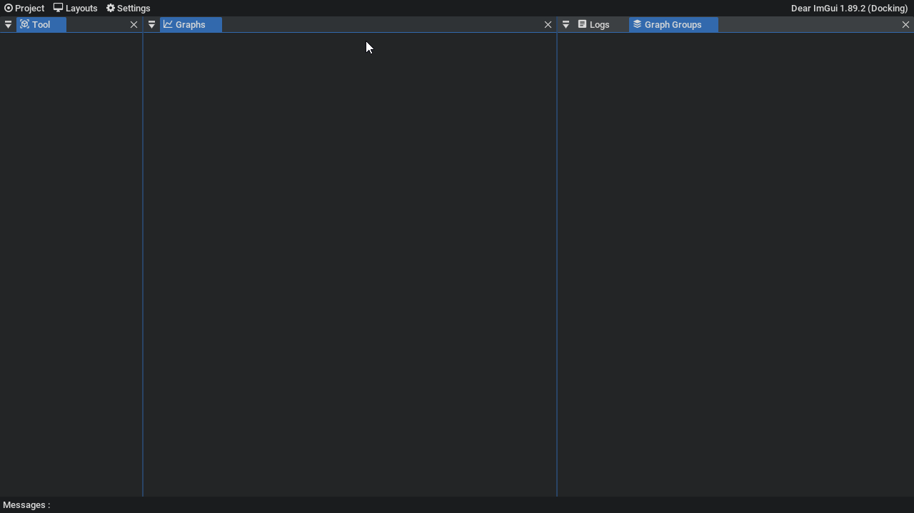
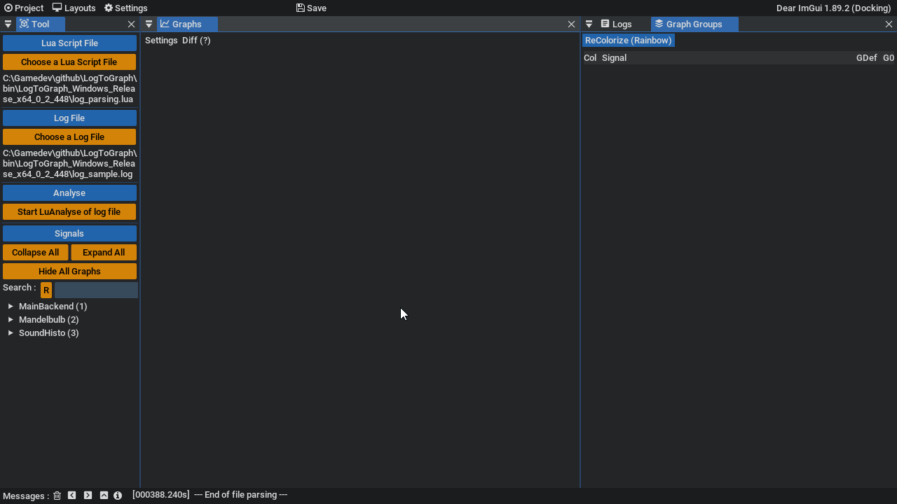
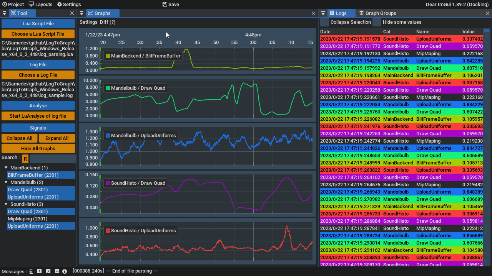
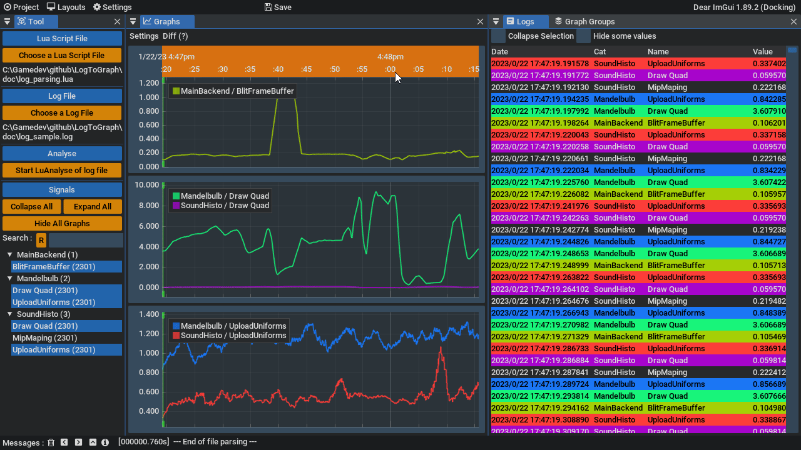
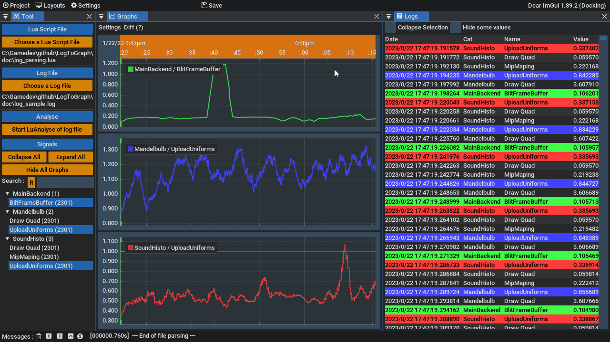
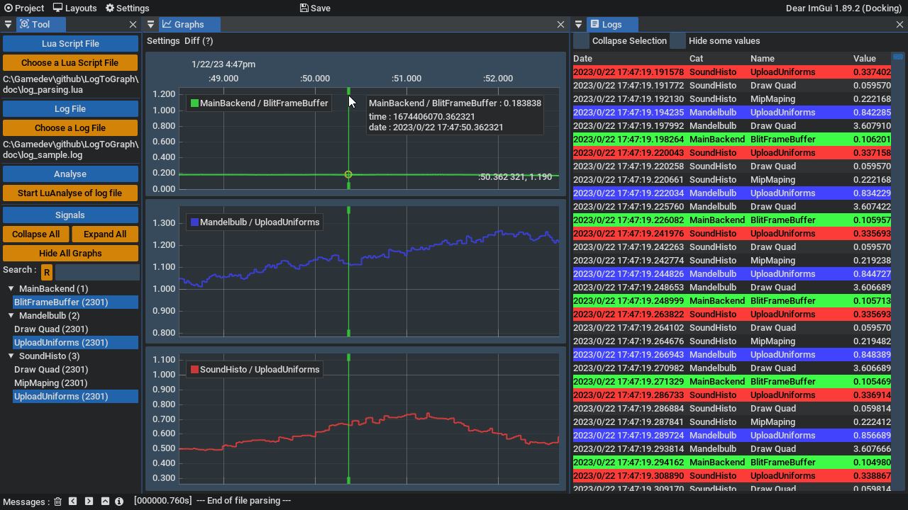
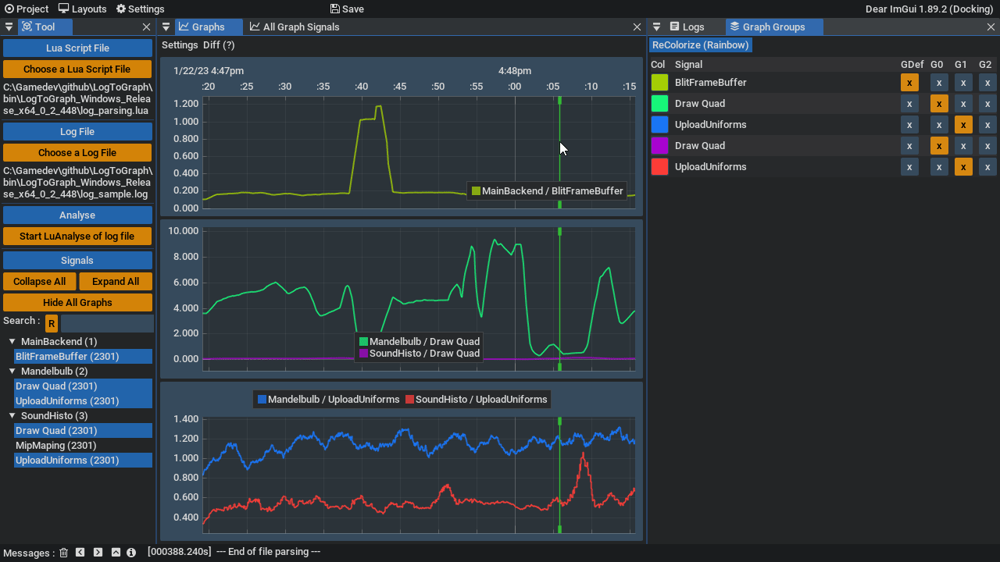

# LogToGraph

| Win64 | Linux |
| ---- | ----- |
| [](https://github.com/aiekick/LogToGraph/actions/workflows/win.yml) | [](https://github.com/aiekick/LogToGraph/actions/workflows/Linux.yml) |

MacOs is not officially maintained but should compile on it; the CMake notes for MacOs are at the bottom of this file.

## Goal

LogToGraph turns text-based numerical logs into interactive signal graphs.

Typical inputs: profilers, electrical / simulation systems, embedded telemetry, scientific instrument logs — anything where each row carries a date, a signal name, and a value (numeric or status string).

The tool can be adapted to any log format because the row-to-signal mapping is implemented by a **Lua script you write inside the app**.

## How it works

1. The tool reads each log file row by row.
2. Each row is handed to a Lua script's `parse(buffer)` function.
3. The script extracts signal samples and feeds them back to the host via the `ltg:*` API (`ltg:addSignalValue`, `ltg:addSignalTag`, etc.).
4. The host stores everything in a SQLite database and renders the resulting signals as interactive graphs.

The script — including the boilerplate `startFile` / `parse` / `endFile` callbacks — lives **inside the project file** (no external `.lua` file to keep around). The whole project is a single `.ltg` SQLite DB you can open with any SQLite tool.

With this you can:

- display many signals across separate graphs
- group several signals on the same graph
- display all signals in a minimal overview
- search signals by name
- show the values of all signals at the hovered timeframe
- mark zones (start / end) and point events (tags)
- diff signal values between two time markers
- annotate delta times by middle-clicking on a curve
- export-free workflow: the project file IS a SQLite DB, openable in any external tool for downstream treatment
- analyse several log files at once with the same parsing script

## Lua scripting workflow

The in-app **Script** pane (in the Code window) is a small but real IDE:

- **Autocomplete** on `.` / `:` — `ltg:` methods, `math.` / `string.` / `table.` / `os.`, plus your own globals (`function helpers.foo()`, etc.) refreshed on every edit.
- **Signature help** on `(` — argument names and types for every documented function. Triggers on `ltg:addSignalValue(`, `math.sqrt(`, `string.match(`, etc.
- **Error markers** — runtime errors surface on the offending line with the real Lua message as a tooltip.
- **Hover-eval** — when paused, hovering an identifier shows its current value in the paused scope (VS-style).
- **Per-project zoom + breakpoints** — `Ctrl+MouseWheel` zooms the editor; the zoom level and all breakpoints are persisted in the project XML.
- **New-project template** — File → New starts you off with a documented boilerplate script (`startFile` / `parse` / `endFile` + the full `ltg:*` API listed as comments).

### Debugger

Toggle Debug in the Code pane toolbar to arm the script debugger.

- **Single-click in the gutter** sets/removes a breakpoint. The dot is visible even when Debug is off (you can plan your breakpoints in advance) and stays inert until Debug is armed.
- **Run / Continue / Step into / Step over / Step out / Pause / Stop** in the toolbar drive the worker. Step buttons jump the editor caret to the live execution line (VS-style); manual caret moves between pauses are preserved.
- **Watcher pane** — typed expressions or right-click → "Watch <token>" in the editor. Re-evaluated in the paused scope on every pause.
- **Stack tree / Scope / Calltrace panes** — call stack, current scope locals + upvalues, and full callstack with source positions. Tables are lazy-expanded.

### Auto-bp + pause on error (opt-in)

Settings → Debug → "Auto-bp + pause on error" (or the Code pane's Debug menu): when ON, every runtime error in the script pauses the worker **synchronously at the throw site** before the stack unwinds. The Lua call stack with locals and upvalues is inspectable, an automatic breakpoint is set at the error line for the next run, and the error message is shown both in the console and as the editor's red tooltip.

Continue resumes the run normally; the error keeps propagating through pcall as if you hadn't paused. Stop aborts the run cleanly.

This works for both C++ exceptions thrown by bindings (`ltg:stringToEpoch` on a bad date format) and pure-Lua errors (`string.match(nil, ...)`, `nil:method()`, bad arg types).

### Debug settings (per-feature toggles)

Settings → Debug, mirrored in the Code pane's Debug menu:

- Recompile project script on edit (powers user-globals autocomplete; turn off for very large scripts)
- Autocomplete popup
- Signature help
- Error markers
- Hover eval tooltip
- Auto-bp + pause on error

## Lua scripting API

The full reference is in [plugins/LuaScripting/README.md](plugins/LuaScripting/README.md). Quick overview:

```lua
function startFile(filepath)
    -- called once per log file, before parse()
end

function parse(buffer)
    -- called once per row with the row's text content
end

function endFile(filepath)
    -- called once per log file, after the last parse()
end
```

Signal emission:

```lua
ltg:addSignalValue("category", "signal_name", epoch, value, "optional_desc")
ltg:addSignalStatus("category", "signal_name", epoch, "running" or "stopped" or ...)
ltg:addSignalStartZone("category", "signal_name", epoch, "label")
ltg:addSignalEndZone("category", "signal_name", epoch, "label")
ltg:addSignalTag(epoch, r, g, b, a, "name", "tooltip")   -- point event, color is linear [0:1]
```

Time conversion (ISO-like "YYYY-MM-DD HH:MM:SS,MS" or "YYYY-MM-DD HH:MM:SS.MS", hour offset as 2nd arg):

```lua
local epoch = ltg:stringToEpoch("2023-01-16 15:24:26,464", 0)
local s     = ltg:epochToString(epoch, 0)
```

Regex (`boost::regex` engine, PCRE-like — supports `|`, `{m,n}`, lookahead, etc., much more expressive than Lua patterns):

```lua
local profilerPattern = ltg:regex([[<profiler section="([^"]*)" epoch_time="([^"]*)" name="([^"]*)" render_time_ms="([^"]*)">]])

function parse(buffer)
    local section, time, name, value = profilerPattern:match(buffer)
    if section then
        ltg:addSignalValue(section, name, tonumber(time), tonumber(value))
    end
end
```

Console logging (visible in the in-app Messaging console):

```lua
ltg:logInfo("...") ; ltg:logWarning("...") ; ltg:logError("...") ; ltg:logDebug("...")
```

Row position (for progress / heuristics):

```lua
ltg:getRowIndex()   -- 0-based index within the current file
ltg:getRowCount()   -- total rows in the current file
```

The Lua stdlib is curated for log-parsing: **base** (tostring / tonumber / pairs / pcall / setmetatable / ...), **string**, **math**, **table**, **os**, **jit**. `io` / `ffi` / `debug` / `package` / `coroutine` / `bit32` are NOT loaded — `io` and `ffi` are full sandbox escapes, `debug.sethook` would override the host's line hook, the rest are simply unused in a parsing context.

## End-to-end walkthrough

### Open a log, write a script, analyse

1. Launch the app.
2. File → New Project. You land on the default boilerplate script with the full API documented in comments.
3. ToolPane (left) → add one or more log files.
4. Edit the Script pane to call `ltg:addSignalValue / addSignalStatus / addSignalTag` based on what each row looks like. Autocomplete + signature help guide you.
5. ToolPane → click Analyse. The worker runs the script over every row of every file.
6. Errors surface in the Console and on the editor's error markers; signals appear in the Graph pane.



### Graph navigation

- **Mouse wheel** zooms in / out on a graph.
- **Left drag** scrolls horizontally; all graphs are synchronized.
- **Right drag** defines a custom time range.
- **Right-click** opens a contextual menu (legend position, axis options, etc.).


### Show graph of selected signals, mouseover, log pane

1. In the ToolPane expand a category.
2. Click signal names to toggle their graphs on / off.
3. Mouse over the curves to see the timeframe values in the Hovered List.
4. Open the Log pane to scan the underlying ticks.



### Group several signals on the same graph + recolor

1. In the Group Graph pane, set the same group column on the rows you want grouped together.
2. Click the color square next to a signal to override its color.
3. Toggle the "auto coloring" in the pane menu to bring back the auto rainbow.



### All-signals minimal view

Layout menu → "all graph signals" — a compact wall of every signal at once.



### Hovered list at the mouse timeframe

Layout menu → "Signals Hovered List" — every signal's value at the timeframe your mouse is over.



### Diff between two timeframe markers

Layout menu → "Signals Hovered Diff", then over the graph press:

- `f` — set the **first** marker (red vertical line)
- `s` — set the **second** marker (blue vertical line)
- `r` — reset

The pane lists every signal whose value changed between the two markers. A tooltip in the Graph pane menu reminds you of the keys.



### Delta-time annotations on a single graph

In a single-graph view, hover a curve until it thickens, **middle-click**, then move to another point on the curve and middle-click again. A delta-time annotation appears with the duration formatted from days down to nanoseconds.

Layout menu → "Annotation Pane" lists all annotations per signal and lets you delete them.


### Save / close project

Project → Close (or app quit) opens a "save changes?" dialog: Save / Save As / Continue without saving / Cancel. The `.ltg` file is a SQLite DB containing the script, the parsed signals, your breakpoints, and the project settings.



## Supported scripting engines

Currently:

- **Lua** (LuaJIT 5.1 via [sol2](https://github.com/ThePhD/sol2) and [boost::regex](https://www.boost.org/doc/libs/release/libs/regex/) for the regex brick) — see [plugins/LuaScripting/README.md](plugins/LuaScripting/README.md).

Planned:

- **AngelScript** — gated on the regex brick + debugger being solid (both are now).

## Limitations

1. Log files must be ASCII / UTF-8 text (no binary).
2. OpenGL is required (the UI is OpenGL-based).

## Build

You need CMake. The CMake usage is identical on Windows, Linux, and MacOS:

1. Pick a build directory (`my_build_directory` here) and a build mode (`Release` / `MinSizeRel` / `RelWithDebInfo` / `Debug`).
2. Generate + build:

```sh
cmake -B my_build_directory -DCMAKE_BUILD_TYPE=BuildMode
cmake --build my_build_directory --config BuildMode
```

Both `-DCMAKE_BUILD_TYPE=` and `--config` are provided because older CMake versions need one or the other.

Before that, make sure you have the dependencies installed.

### On Windows

OpenGL libraries (system).

### On Linux

X11, Xrandr, Xinerama, Xcursor, Mesa. On Debian-likes:

```sh
sudo apt-get update
sudo apt-get install libgl1-mesa-dev libx11-dev libxi-dev libxrandr-dev libxinerama-dev libxcursor-dev
```

### On MacOS

OpenGL and Cocoa frameworks.
