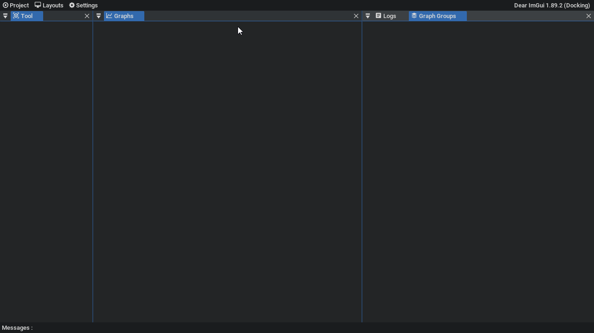

# LogToGraph

| Backend | Win64 | Linux |
| ------- | --- | ----- |
| Opengl 3 | [](https://github.com/aiekick/LogToGraph/actions?query=workflow%3AWin64) | [](https://github.com/aiekick/LogToGraph/actions?query=workflow%3ALinux) |

MacOs is not officially maintained but i think he can compile on it.
So i let the cmake infos about MacOs in bottom of this ReadMe.

## Goal :

LogToGraph have been designed to display numerical signals based logs as graph.

The kind of logs you have in mesuring systems like, profiler, electric system/simulator, etc...

This tool can be adapted to many log formats, since the log pattern matching is achieved by a lua script.

## How is working :

1) The tool will read your log row by row.
2) Each row will be put in the memory space of your lua script inside a lua variable
3) The lua script will parse the row and will add a signal tick with infos (category, epoch time, signal name, signal value)
4) the tool will display all signal in graph

with this tool you can :
 - display many signals in separate graph
 - display many signals grouped per graph group
 - display all signals in a minimal view
 - search for a signal name
 - show the values of all signals at the timeframe hovered by the mouse
 - show zone of signals (start / end)
 - show a special tag for point event (like erreors by ex)
 - show the changed signals values between two timeframe markers
 - display the whole singals tick in a log view
 - display the whole singals tick in a second log view (for compare with the first)
 - display a code pane for let you test/design your lua script
 - the porject file is a sqlite database, so you can open it again without reparse or do treatment with other apps
 - you can have parse many log file but with the same parsing lua file
 
## Howto : Lua Script file

you must have at least a function 'Init" in the lua script. (this is the entry point)
```lua
function Init()
	SetRowBufferName("buffer_row");
	SetFunctionForEachRow("eachRow");
end
function eachRow()
	_section, _time, _name, _value = string.match(buffer_row, "<profiler section=\"(.*)\" epoch_time=\"(.*)\" name=\"(.*)\" render_time_ms=\"(.*)\">")
	if _section ~= nil and _time ~= nil and _name ~= nil and _value ~= nil then
		AddSignalValue(_section, _name, _time, _value)
	end
end
```

in this 'Init' fucntion you will call :

1) "SetRowBufferName" => will indicate to the tool the name of the varaible who will contain the log file row
2) "SetFunctionForEachRow" => will indicate to the tool the name of the function who will be called each log file row

in the eachRow function we can have a parsing system (here based on string.match)
Who will be used for separate log file row components to add as a signal via the fucntion "AddSignalValue"

In the sample directory you have a lua file and his corresponding log file.
You have more fucntions available, you can check theme in the sample lua script doc/log_parsing.lua 

## Howto : Analyse of the log file in LogToGraph

### Open lua and log file then analyse them

1) open the app
2) in menu, click new
3) in the tool pane, you have three buttons
4) in the tool pane, select your lua script
5) in the tool pane, select your log file
6) in the tool pane, click on the analyse buttons



### show graph of some signals, mouse over, log pane

1) in the tool pane, expand some category
2) click on some signals
3) mouse over some signals to see infos of hovered timeframe
4) click on log pane title and explore it


### group some signals on the same graph, modify signal color mode (auto rainbow or custom)

1) in the group graph pane
2) on a signal row, select anpother group column. 
   each new comlumn except the gdef, will be group graph
3) click on a color button, and change the color of the signal.
4) then click back on the auto coloring nbutton in pane menu


### graph navigation

1) mouse hover a graph
2) with the wheel button, zoom in
3) with the left mouse button, slide horizontally -you will see than all grpah are synchronized)
4) with the right mouse button, you can click and drag for define a custom time range
5) click right on it and a menu will appear, with it you can do many thing and by ex move the legend


### display a minimal view of all signals graph

1) go in layout menu
2) select entry "all graph signals"
3) explore this new pane


### display a list of signal at the mouse hovered frametime 

1) go in layout menu
2) select entry "Signals Hovered List"
3) now go over signals with mouse and observe the "Signals Hovered List" pane change his values


### display a diff list of signal between two frame time markers 

1) go in layout menu
2) select entry "Signals Hovered Diff"
3) now mouse over a signal and press the key "f" like first, you will see a red vertical line, you can move it with mouse
3) move the mouse horizontally over a signal and press the key "s" like second, you will see a blue vertical line, you can move it with mouse
4) observe the pane "Signals Hovered Diff", you will see in it all signals who have change their value between the two markers
5) you can press the key "r" like reset, for remove the markers
6) you have a tip explaining this, in the graphs pane menu


### measure delta time between two time marks

1) available only on alone graph
2) mouse hover a curve
3) when the cruve is thick, clik with the middle mouse button
4) then move the mouse on another part of the curve
5) when this new pos is thick too, click with the middle mouse ubtton agian
6) and you have a Annotation wiht the delta time. hte biggest unit is the day, the lowest the nano seconds.

for delete or see all your Annotations, open the layout menu, then click on Annotation Pane
then you have a list of all annotations per signal, then you can click on the cross on the left for delete what you want.


### save project file

1) got in menu then press on close item
2) a dialog appear in the center of the app
3) you can save the current proejct, save as a new project, continue without saving or cancel
4) the project is closed

you also have this dialog when you quit the app
  


## Limitations :

1) The log file must be ascii file
2) You need opengl for using it, since the ui is a opengl based gui

## Howto Build :

You need to use cMake.
For the 3 Os (Win, Linux, MacOs), the cMake usage is exactly the same, 

1) Choose a build directory. (called here my_build_directory for instance) and
2) Choose a Build Mode : "Release" / "MinSizeRel" / "RelWithDebInfo" / "Debug" (called here BuildMode for instance)
3) Run cMake in console : (the first for generate cmake build files, the second for build the binary)
```cpp
cmake -B my_build_directory -DCMAKE_BUILD_TYPE=BuildMode
cmake --build my_build_directory --config BuildMode
```

Some cMake version need Build mode define via the directive CMAKE_BUILD_TYPE or via --Config when we launch the build. 
This is why i put the boths possibilities

By the way you need before, to make sure, you have needed dependencies.

### On Windows :

You need to have the opengl library installed

### On Linux :

You need many lib : (X11, xrandr, xinerama, xcursor, mesa)

If you are on debian you can run :  

```cpp
sudo apt-get update 
sudo apt-get install libgl1-mesa-dev libx11-dev libxi-dev libxrandr-dev libxinerama-dev libxcursor-dev
```

### On MacOs :

you need many lib : opengl and cocoa framework
