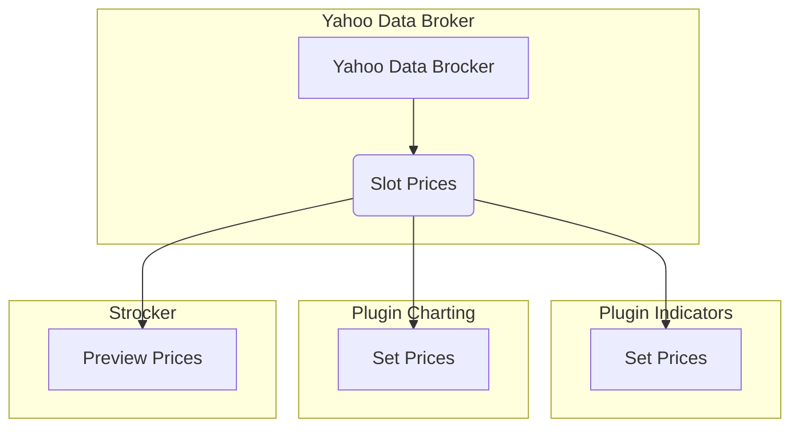

# Yahoo Broker

On ce conencte a une url de requete

on doit pouvoir via un panel de brocker :
* selectionner le broker
* le type de donnée
* le timeframe
* la plage de data
* une barre de progression

les donnée seront teleccahrgé soit en stream ou par fichier

le deuxime implique un parse apres du fichier et suaver dans une bd sqlite

It must be capable of :
- display the Yahoo ui for selct what to get
- return prices to strocker
- maybe ahave a custom pane fro debug the infos

Slots Types :
* Prices [Strocker]

Nodes Types :
* Preview Prices [Strocker] 
* YahooDataBrocker [New]

